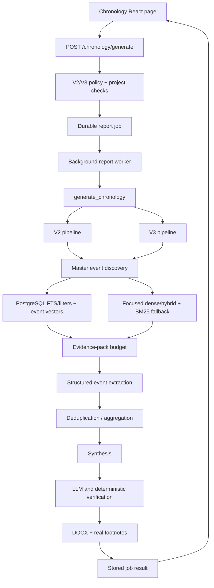
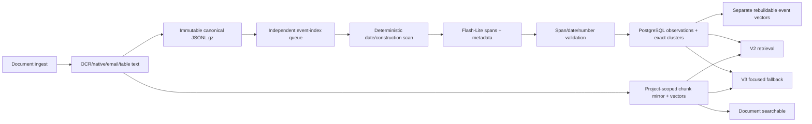

# Architecture and dependency map

## Active report flow

## Ingest-time path

The legacy DuckDB event timeline remains a separate old UI/API and is not
silently promoted. New issue chronologies select master observations first and
use old chunk/document retrieval only for explicit coverage gaps.

## Shared with Chatbot and the wider application

- **Terminology:** both use the same `JargonManager` and request-local prepared
  query context.
- **Retrieval:** V2 uses the same `DocumentRAG`, vector backend, reranker, lexical
  index, and chunk mirror used by document question answering.
- **Document ingestion:** OCR/parser output, chunk identities, document registry,
  and document metadata are created before Chronology runs.
- **LLM gateway:** model selection, caching, structured schema validation,
  billing attribution and run telemetry are application-wide.
- **Project isolation:** user/project context is supplied by the API and worker,
  not implemented inside the chronology engines.

The pack includes the Chronology-facing surfaces of these shared layers, not
their complete product implementations. See
[EXTERNAL_DEPENDENCIES.md](EXTERNAL_DEPENDENCIES.md).

## Review-sensitive boundaries

| Boundary | Current guarantee | Not guaranteed |
|---|---|---|
| Retrieval | Project-scoped event observations first; legacy fallback is document/facet scoped | Gold-set-proven corpus recall |
| Evidence ID | Immutable segment, selected char span and hashes for master observations | Span guarantees for legacy fallback excerpts |
| Validation | Source IDs, dates, numbers and quotes checked against supplied evidence | Recovery of events never retrieved |
| Aggregation | Exact-key clusters retain every source-bound observation; synthesis must return every cluster ID | Semantic near-duplicate clustering or recovery of observations never extracted |
| Final size | No global 18-event truncation; synthesis/verification are bounded batches | Corpus census or unlimited retrieval |
| Master memory | Full canonical segment scan, re-verifiable spans, version lineage and exact clusters | Recall targets until measured on the gold set |
| Legacy timeline | Existing screen/API remains readable | Verified migration into master memory |
| DOCX | Real footnotes with document/page or sheet/row identity | Cryptographic proof of the exact supporting source span |
